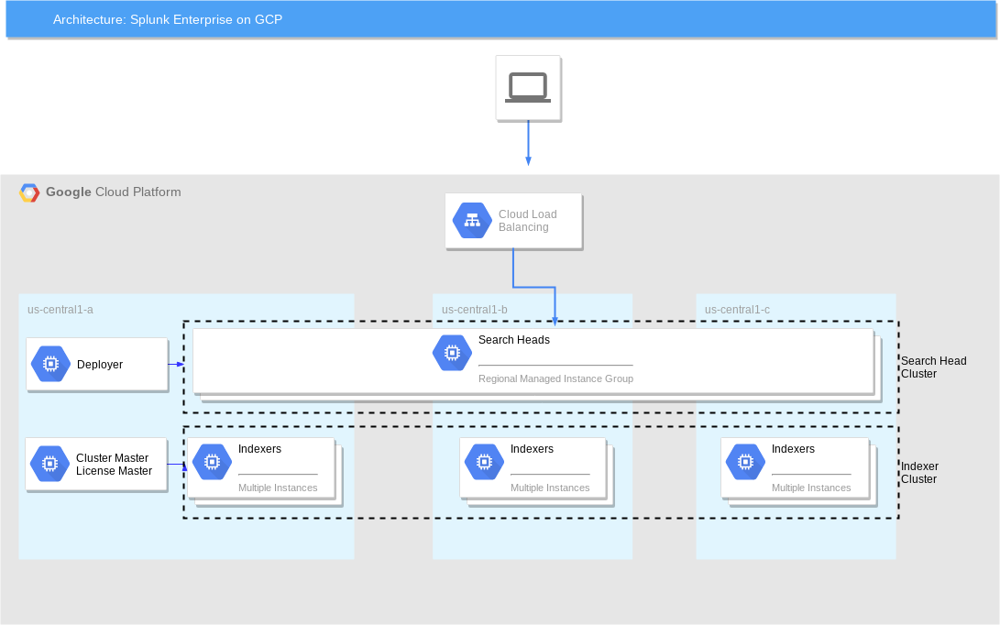

# Terraform templates for Splunk Enterprise on GCP

A set of Terraform templates to deploy distributed multi-zone Splunk Enterprise in a user-specified GCP region. Deployment includes a pre-configured indexer cluster where cluster master also acts as license master, as well as a pre-configured search head cluster with a deployer. Indexer cluster splunktcp and http event collector (HEC) input are pre-configured and ready to receive data. Search head cluster is fronted by a global load balancer for user web traffic. Indexer cluster is fronted by a global load balancer for HEC data traffic. For splunktcp data traffic, indexer discovery is pre-enabled so Splunk Forwarders can automatically discover list of peer nodes and natively load balance data across indexer cluster.

These deployment templates are provided for demo/POC purposes only.

### Architecture Diagram



### Configurable Parameters

Parameter | Description 
--- | ---
project | The project to deploy to, if not set the default provider project is used
region | Region for cloud resources
zone | Zone for cloud resources
splunk_idx_cluster_size | Size of Splunk indexer cluster (multi-zone)
splunk_sh_cluster_size | Size of Splunk search head cluster (multi-zone)
splunk_admin_password | Splunk admin password
splunk_cluster_secret | Splunk secret shared by indexer and search head clusters
splunk_indexer_discovery_secret | Splunk secret for indexer discovery
splunk_network | Network to deploy Splunk onto
create_network | Boolean (default true) to create splunk network (set to false to reuse existing network)

### Getting Started

#### Requirements
* Terraform 0.12

#### Setup working directory

1. Copy placeholder vars file `variables.yaml` into new `terraform.tfvars` to hold your own settings.
2. Update placeholder values in `terraform.tfvars` to correspond to your GCP environment and desired Splunk settings. See [list of input parameters](#configurable-parameters) above.
3. Initialize Terraform working directory and download plugins by running `terraform init`.

#### Deploy Splunk Enterprise

```shell
$ terraform plan
$ terraform apply
```

#### Access Splunk Enterprise

Once Terraform completes:

1. Confirm indexer cluster is configured correctly with all nodes up & running:
  * Navigate to `https://<splunk-cluster-master-public-ip>:8000/en-US/manager/system/clustering?tab=peers`

2. Visit Splunk web
  * Navigate to `https://<splunk-shc-splunkweb-address>/`
  * Login with 'admin' user and the password you specified (`splunk_admin_password`)

3. Send data to Splunk via Splunk Forwarders (Option A)
  * Point Splunk Forwarders to `https://<splunk-cluster-master-public-ip>:8089` to auto-discover indexers and forward data to indexer cluster directly. Configure forwarders with Splunk secret that you have specified (`splunk_indexer_discovery_secret`). Follow instructions [here](https://docs.splunk.com/Documentation/Splunk/7.2.6/Indexer/indexerdiscovery#3._Configure_the_forwarders) for more details.
 
4. Send data to Splunk via HEC (Option B)
  * Send data to HEC load balancer `https://<splunk-idx-hecinput-address:8080`. Use HEC token returned by Terraform. Refer to docs [here](https://docs.splunk.com/Documentation/Splunk/7.2.6/Data/UsetheHTTPEventCollector#Example_of_sending_data_to_HEC_with_an_HTTP_request) for example of an HTTP request to Splunk HEC.

### TODOs

* Create & use base image with Splunk binaries + basic system & user configs
* Add data disks with user-specified size to indexers
* Make startup script (Splunk configuration) more modular
* Make terraform configuration more modular

### Authors

* **Roy Arsan** - [rarsan](https://github.com/rarsan)
* **Cuyler Dingwell**

### Support

This is not an officially supported Google product. Terraform templates for Splunk Enterprise are developer and community-supported. Please don't hesitate to open an issue or pull request.

### Copyright & License

Copyright 2019 Google LLC

Terraform templates for Splunk Enterprise are licensed under the Apache license, v2.0. Details can be found in [LICENSE](./LICENSE) file.
