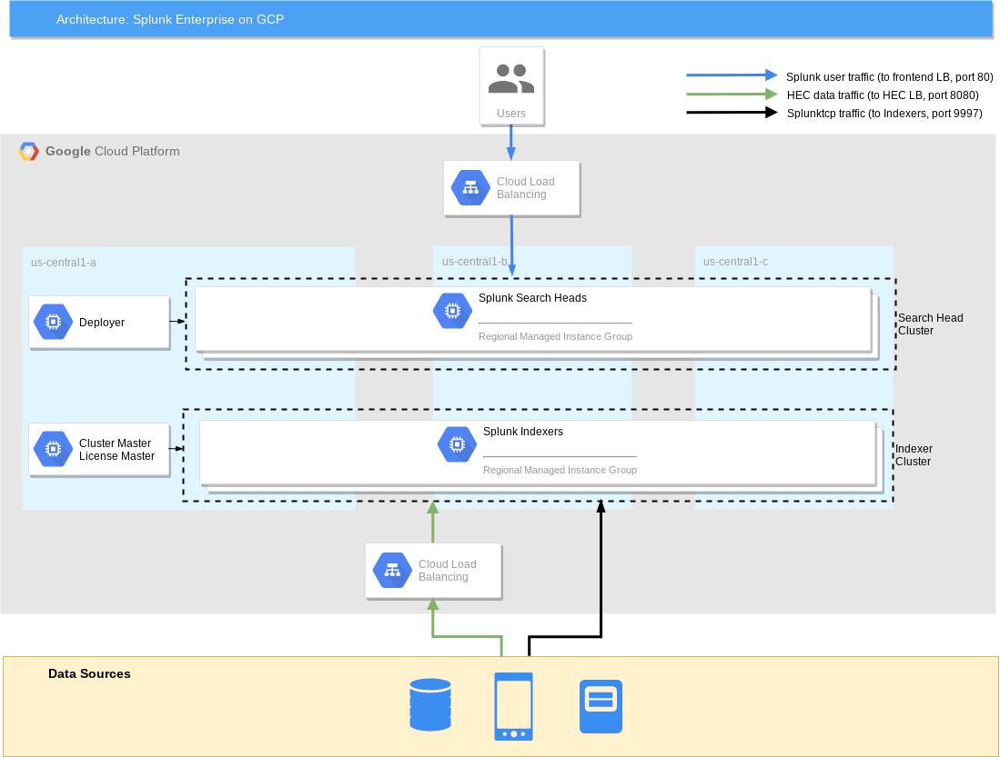

# Terraform templates for Splunk Enterprise on GCP

A set of Terraform templates to spin up a multi-zone Splunk Enterprise deployment in a given GCP region. Deployment includes a pre-configured indexer cluster where cluster master also acts as license master, as well as a pre-configured search head cluster with a deployer. Indexer cluster splunktcp and http event collector (hec) input are pre-configured and ready to receive data. Search head cluster is fronted by a global load balancer for user web traffic. Indexer cluster is fronted by a global load balancer for hec data traffic. For splunktcp data traffic, indexer discovery is pre-enabled so Splunk Forwarders can automatically discover list of peer nodes and natively load balance data across indexer cluster.

These deployment templates are provided for demo/POC purposes only.

### Architecture Diagram




### Setup

1. Copy placeholder vars file `variables.yaml` into new `terraform.tfvars` to hold your own settings.
2. Update placeholder values in `terraform.tfvars` to correspond to your GCP environment and desired Splunk settings.
3. Initialize Terraform working directory and download plugins by running `terraform init`.

#### Input Variables

Input | Description 
--- | ---
project | The project to deploy to, if not set the default provider project is used
region | Region for cloud resources
zone | Zone for cloud resources
splunk_idx_cluster_size | Size of Splunk indexer cluster (multi-zone)
splunk_sh_cluster_size | Size of Splunk search head cluster (multi-zone)
splunk_admin_password | Splunk admin password
splunk_cluster_secret | Splunk secret shared by indexer and search head clusters
splunk_indexer_discovery_secret | Splunk secret for indexer discovery

### Usage

```shell
$ terraform plan
$ terraform apply
```

### Default Firewall Rules


### Next Steps (TODOs)

* Create & use base image with Splunk binaries + basic system & user configs
* Add data disks with user-specified size to indexers
* Make startup script (Splunk configuration) more modular
* Make terraform configuration more modular
* Secure Splunk user-specified credentials - currently may be leaked from instance metadata
